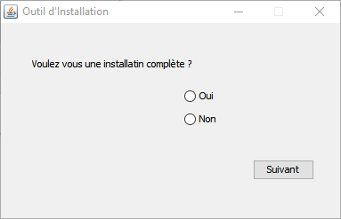

*Université de Jijel* +
*Faculté des Sciences Exactes et d'Informatique* +
*Département d'Informatique*

== Données Semi-Structurées : Controle TP (01)

*Enoncé*

L'objectif est de créer un outil d'aide à l'installation. L'outil doit demander 
à l'utilisateur les informations suivantes :

* Fenêtre 01 : Est-ce que l'installation est complète ou pas ? (2 boutons radio)
** Option 01 : Oui
** Option 02 : Non
* Fenêtre 02 : Le chemin d'installation (un champ de saisie)
* Fenêtre 03 :
** Le nom de l'utilisateur (un champ de saisie)
** Le nom de l'organisation (un champ de saisie)
* Fenêtre 04 : Clé de licence (un champ de saisie).

La dernière fenêtre ne contient qu'un message qui confirme la fin de l'installation. 
En cliquant sur le bouton "Terminer", un fichier XML qui contient la configuration 
introduite par l'utilisateur doit être créé.

