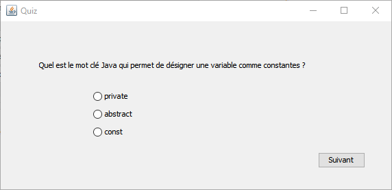
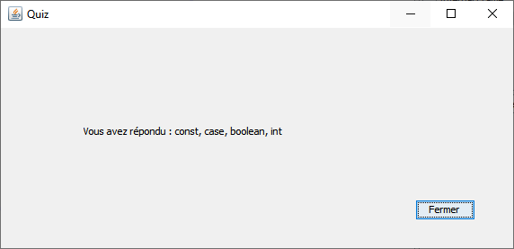

*Université de Jijel* +
*Faculté des Sciences Exactes et d'Informatique* +
*Département d'Informatique*

== Données Semi-Structurées : Controle TP (02)

*Enoncé*

L'objectif de ce TP est de créer un outil de Quiz. L'outil à créer doit pouvoir lire un 
fichier XML qui contient les questions du Quiz. Chaque question possède exactement trois 
choix parmi lesquels l'utilisateur doit choisir une réponse. 
L'outil doit afficher les questions l'une après l'autre. La dernière fenêtre contiendra 
les réponses choisies.

Exemple XML :
----------
<quiz>
	<question n = "01">
		<enonce>Comment déclarer un entier en Java</enonce>
		<leschoix>
			<choix>int</choix>
			<choix>numero</choix>
			<choix>entier</choix>
		</leschoix>
	</question>
	...
</quiz>
----------

