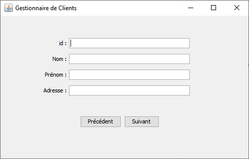

*Université de Jijel* +
*Faculté des Sciences Exactes et d'Informatique* +
*Département d'Informatique*

== Données Semi-Structurées : Controle TP (03)

*Enoncé*

L'objectif de ce TP est de créer un gestionnaire de Clients. Ce gestionnaire permet de
visualiser les clients d'une entreprise. Ces clients sont enregistrés dans un fichier
XML. Un client se caractérise par :

* id
* nom
* prénom
* adresse

L'outil offre deux boutons fonctionnels :

* Suivant : mettre à jour l'interface pour afficher le client suivant,
* Précédent : mettre à jour l'interface pour afficher le client précédent.

Exemple XML :
----------
<clients>
	<client id="1">
		<nom>Benamer</nom>
		<prenom>Amer</prenom>
		<adresse>Jijel</adresse>
	</client>
	...
</clients>
----------

