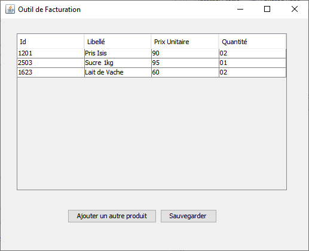
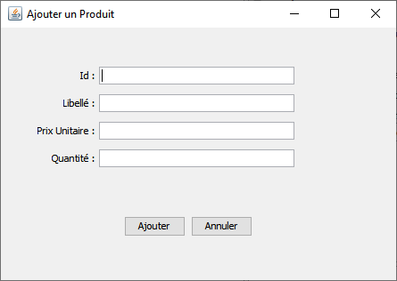

*Université de Jijel* +
*Faculté des Sciences Exactes et d'Informatique* +
*Département d'Informatique*

== Données Semi-Structurées : Controle TP (04)

*Enoncé*

L'objectif de ce TP est de créer un outil de facturation. Une facture liste plusieurs 
produits avec le prix de chaque produit (un produit se caractérise par un id et un libellé) 
et la quantité achetée. Dans cet exemple,
nous allons nous concentrer sur la liste de produits, leurs prix et leurs quantités
sans faire des calculs.

L'affichage de la liste des produits (comme dans l'interface ci-dessus) n'est pas obligatoire.

