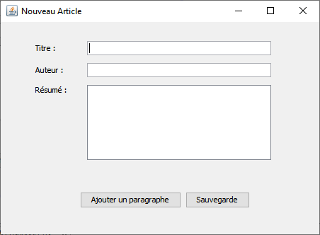
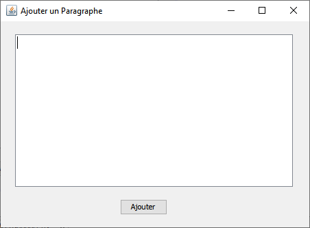

*Université de Jijel* +
*Faculté des Sciences Exactes et d'Informatique* +
*Département d'Informatique*

== Données Semi-Structurées : Controle TP (05)

*Enoncé*

L'objectif de ce TP est de créer un outil qui permet la rédaction d'article.
Un article contient un titre, un auteur, un résumé, et un contenu. Le contenu se
compose de plusieurs paragraphes.

