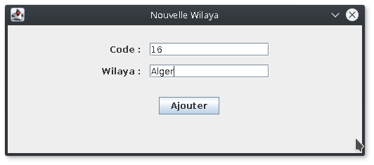
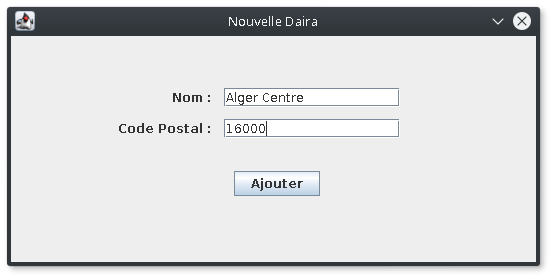
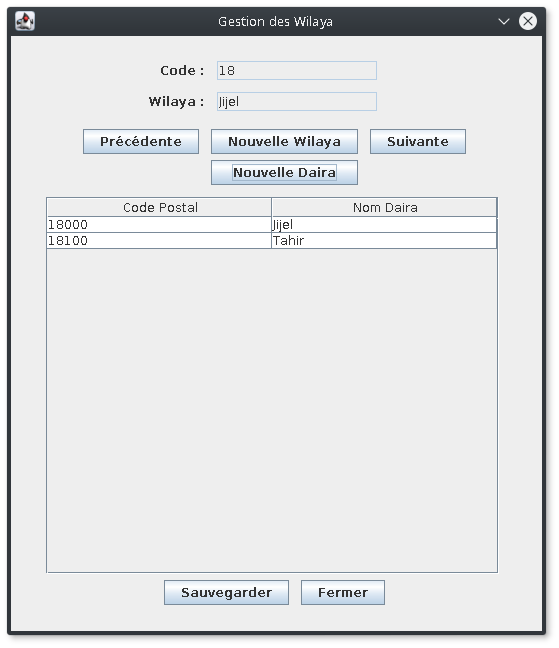

*Université de Jijel* +
*Faculté des Sciences Exactes et d'Informatique* +
*Département d'Informatique*

=== Données Semi-Structurées : Controle TP (01)

Nous voulons créer une petite application pour gérer les Wilayas et
leurs Dairas. L'application permet de parcourir les wilayas et d'afficher
les dairas de chaque wilaya. elle permet aussi d'ajouter des wilayas et
des dairas.

*Travail demandé*

Réalisez l'application décrite en utilisant un fichier XML comme support
de stockage.

*Notes importantes*

* L'utilisation du modèle MVC est essentielle,
* Les captures ci-dessous sont à titre indicatif (des exemples), vous 
pouvez concevoir l'IHM de votre application autrement.

