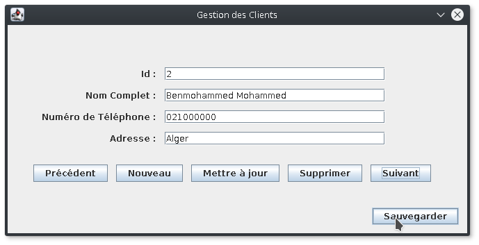
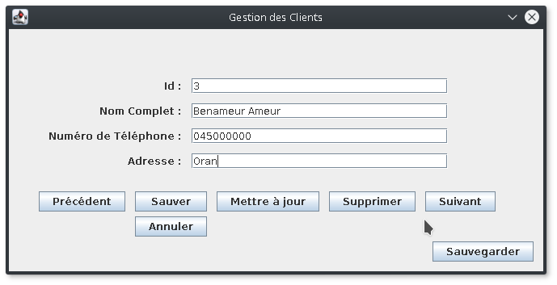

*Université de Jijel* +
*Faculté des Sciences Exactes et d'Informatique* +
*Département d'Informatique*

=== Données Semi-Structurées : Controle TP (02)

Notre objectif est de créer une application de gestion des clients.
L'application ouvre un fichier XML qui contient les données des clients,
puis, elle permet à l'utilisateur de parcourir ces données, ajouter de
nouveaux clients, modifier les données des clients et supprimer des clients.
L'application permet de sauvegarder les nouvelles données dans le même
fichier ouvert.

*Travail demandé*

Réalisez l'application décrite ci-dessus.

*Notes importantes*

* L'utilisation du modèle MVC est essentielle,
* Les captures ci-dessous sont à titre indicatif (des exemples), vous 
pouvez concevoir l'IHM de votre application autrement.

