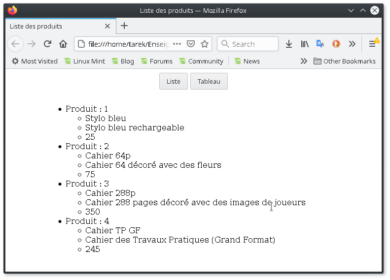
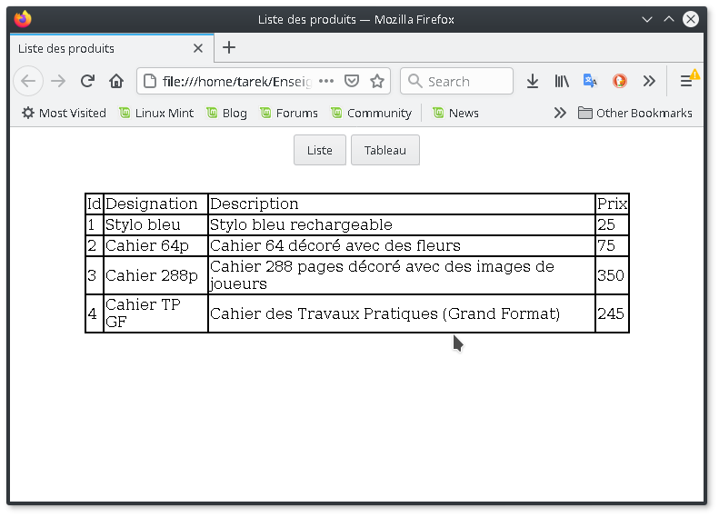

*Université de Jijel* +
*Faculté des Sciences Exactes et d'Informatique* +
*Département d'Informatique*

=== Données Semi-Structurées : Controle TP (03)

Pour une meilleure expérience, il est recommandé d'offrir à l'utilisateur
du site web plusieurs modes d'affichage. Les listes et les tableaux
sont deux modes d'affichage dédiés aux grandes quantités de données.

*Travail demandé*

Réalisez une page web qui permet à l'utilisateur de basculer entre
l'affichage sous forme de liste et l'affichage sous forme de tableau.

*Notes importantes*

* L'objectif est la manipulation du DOM, aucune autre approche ne sera 
acceptée.
* L'utilisation du modèle MVC est essentielle,
* Les captures ci-dessous sont à titre indicatif (des exemples), vous 
pouvez concevoir l'IHM de votre application autrement.

