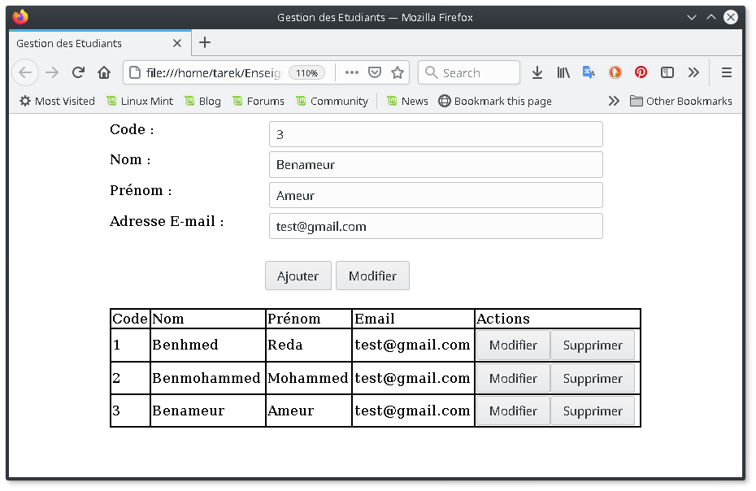

*Université de Jijel* +
*Faculté des Sciences Exactes et d'Informatique* +
*Département d'Informatique*

=== Données Semi-Structurées : Controle TP (04)

Grâce au Javascript et sa capacité à manipuler le DOM de la page web, il
est possible aujourd'hui de créer des applications web aussi performantes
que les applications desktop. L'objectif de ce projet est de créer une
application web (page web + scripts Javascript nécessaires) qui permet
de créer, modifier et supprimer des éléments d'une table (liste de
personnes par exemple).

*Travail demandé*

Réalisez une page web qui permet à l'utilisateur de réaliser les actions 
mentionnées. L'affichage des éléments doit être sous forme d'un tableau.

*Notes importantes*

* L'objectif est la manipulation du DOM, aucune autre approche ne sera 
acceptée. Cette condition concerne les cellules qui contiennent des
données.
* L'utilisation du modèle MVC est essentielle,
* Les captures ci-dessous sont à titre indicatif (des exemples), vous 
pouvez concevoir l'IHM de votre application autrement.

